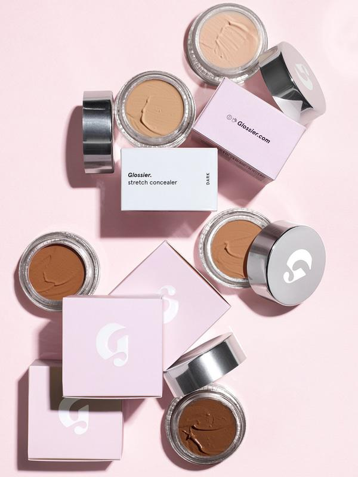
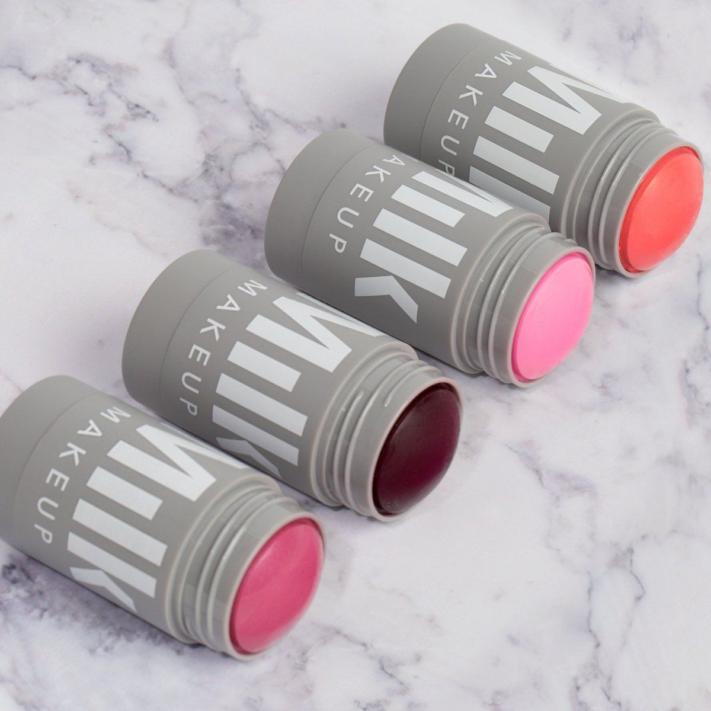

# Reccomendations On The Best Makeup Products and How to Approach Your Routine

When it comes to doing your makeup and what steps are best to include in your routine, I would say everyone has their own favorite products but including a few basic specific products will help your makeup look better. 

Here below is a list of products that you could include before and after to help your makeup stay on longer and go on smoother.

**1. Moisturizer: Before applying any liquid products on your face, you should have a good moisturizer to ensure your skin is hydrated and to help smooth your skin's surface. You should choose any moisturizer that works best for you whether it is high-end or from the drugstore.**

**2. Primer: After applying moisturizer, you could add a primer as a base to help your makeup last longer or to conceal your pores or blur any imperfections. Some of the best primers include Benefit:Porefessional, Tatcha The Silk Canvas or Milk Hydro Grip Primer.**

**3. Setting Spray: Setting spray is the last thing you would need after you complete your makeup to freshen your face and to help keep any areas from creasing (look unblended) or to keep it on for longer periods of time.**

Linked below is a list of the number one primer I would reccomend - 
For more details see [Sephora Site](https://www.sephora.com/product/the-porefessional-face-primer-P264900/) 

## New Makeup Products I Reccommend Trying
- If you're looking for a more natural and hydrated look for your face, the first thing I would reccommend is using more cream products, especially cream blush. The newest product I've gotten and found to work the easiest and look best, is the Milk Lip+Cheek Duo. 

- If you're looking to not use a foundation or have a light layer of makeup to conceal a few things, I would reccommend only using concealer in the certain areas of your face you want to cover in order to not have a heavy look. My favorite concealers include the Too faced Born This Way Sculpting Concealer and the Glossier Stretch Concealer. Depending on how much coverage you actually want, the Too Faced would work a lot better due to it being buildable depending on how much is applied. The Glossier Stretch is very easy to apply and covers any problem areas and certain discolored areas very easily. Both are very hydrating and natural. 

 
